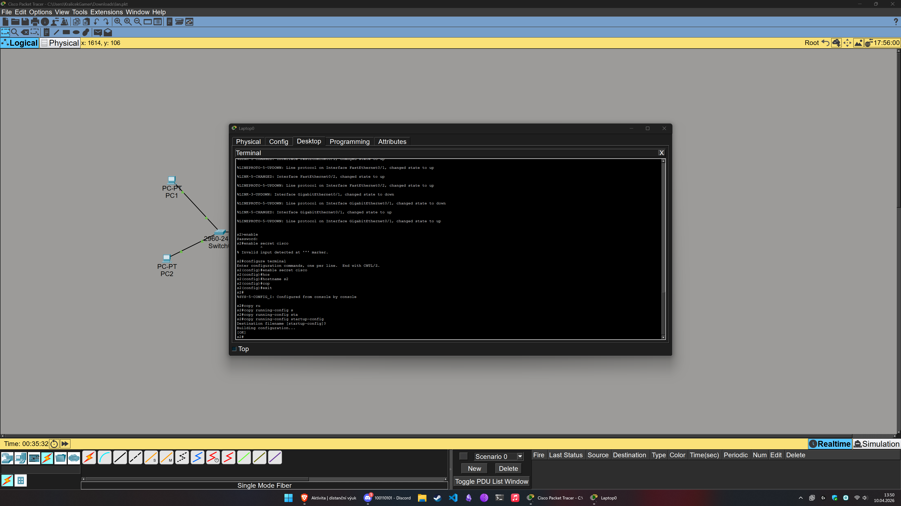
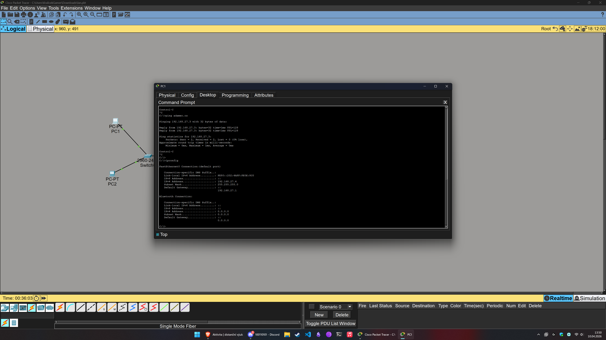
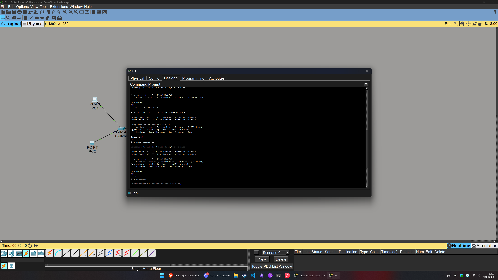
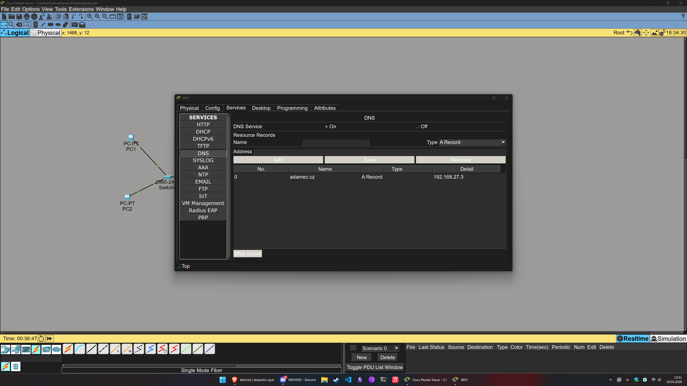
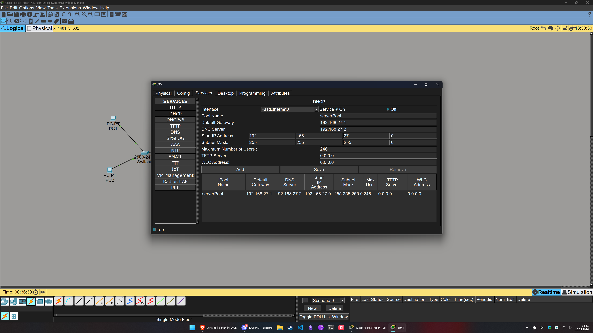
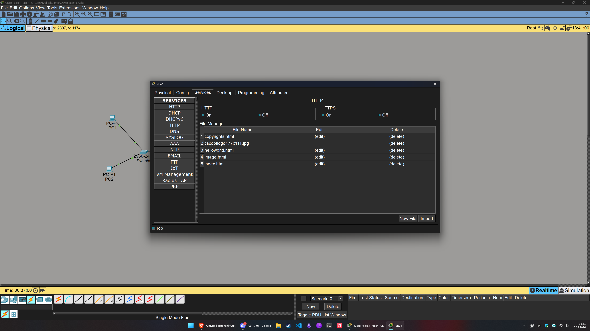

# Cisco Packet Tracer - LAN Model

Tento repozitář obsahuje model lokální sítě (LAN) vytvořený v programu Cisco Packet Tracer podle zadaných požadavků.

## Popis sítě

Síť se skládá ze dvou propojených switchů (S1 a S2). Do switche S1 jsou připojeny dvě koncové stanice (PC1 a PC2). Do switche S2 jsou připojeny dva servery (SRV1 a SRV2). K základní konfiguraci switchů byl použit Laptop připojený přes terminál (konzolový kabel).

### Adresování
Přidělený síťový rozsah je **192.168.X.0 / 24**.

**Výpočet X:** X je součet ordinálních hodnot všech písmen příjmení (velkými bez diakritiky) modulo 256. Pro toto zadání bylo vypočteno a stanoveno **X = 27**.

Rozsah sítě je tedy: **192.168.27.0 / 24**

### Zařízení a jejich konfigurace
- **S1 (Switch):** Propojen se switchem S2 a koncovými stanicemi PC1 a PC2. Nakonfigurován přes Laptop.
- **S2 (Switch):** Propojen se switchem S1 a servery SRV1 a SRV2. Nakonfigurován přes Laptop.
- **Laptop:** Slouží výhradně ke konfiguraci switchů S1 a S2 přes terminálové (konzolové) připojení.
- **SRV1 (DHCP + DNS):** Má přidělenou statickou IP adresu. Funguje jako DHCP server poskytující IP konfiguraci (adresu, masku, gateway) směrem k PC2. Zároveň běží jako DNS server spravující doménu (s příjmením) odkazující na webový server SRV2.
- **SRV2 (WEB):** Má přidělenou statickou IP adresu. Poskytuje jednoduchou webovou stránku, na které je zobrazeno jméno a příjmení.
- **PC1:** Má nastavenou statickou IP adresu.
- **PC2:** Získává IP konfiguraci dynamicky z DHCP serveru běžícího na SRV1.

## Snímky obrazovky
### Laptop - nastavování switche

*Terminál na Laptopu s ukázkou zápisu základní konfigurace switche.*

### PC1 - ipconfig

*Výpis příkazu konfigurace sítě na počítači PC1 (staticky nastavena).*

### PC1 - ping na SRV2 (oběma způsoby)

*Ukázka pingu z počítače PC1 na server SRV2 pomocí IP adresy a pomocí spravovaného doménového jména.*

### Nastavení DNS (SRV1)

*Založený DNS záznam směrující doménu na IP adresu webového serveru SRV2.*

### Nastavení DHCP (SRV1)

*Konfigurace DHCP poolu pro automatické přidělování adres stanicím (jako je PC2).*

### Nastavení WEB (SRV2)

*Konfigurace HTTP služby obsahující vizualizaci index stránky se jménem a příjmením.*

## Soubory v repozitáři
- `lan.pkt` - Soubor projektu z programu Cisco Packet Tracer.
- `README.md` - Dokumentace k přidělenému úkolu.
